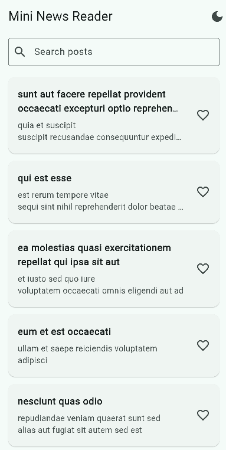
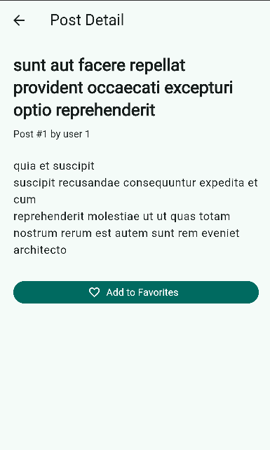
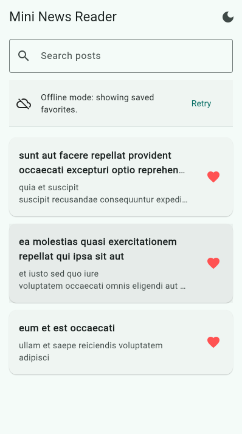

# Mini News Reader

A Flutter practice exam app that fetches posts from JSONPlaceholder, displays
them in a clean UI, and persists favorite posts for offline viewing.

## Run

Install dependencies:

```bash
flutter pub get
```

Run on Android, iOS, Linux, or another normal Flutter device:

```bash
flutter run
```

Run in Chrome:

```bash
flutter run --profile -d chrome
```

Flutter 3.44 has a DWDS injected-client crash in Chrome debug mode on this
machine. Profile mode avoids that debug-only client and renders normally.

Build web release output:

```bash
flutter build web
```

Test offline app-shell reload in browser:

```bash
flutter run --profile -d chrome
```

Open the Flutter-provided browser URL once while online, wait for posts,
favorite at least one post, then switch DevTools Network to Offline and refresh.
The app shell reloads from the service worker, and the API failure shows saved
favorites.

## Features

- Fetches posts from `https://jsonplaceholder.typicode.com/posts`
- Provider-based state management
- Home and detail screens
- Add/remove favorites
- Favorite persistence with `shared_preferences`
- Offline fallback to saved favorites
- Offline web refresh after first online load
- Search, pull-to-refresh, and dark mode

## Screenshots

### Home



### Detail



### Offline


